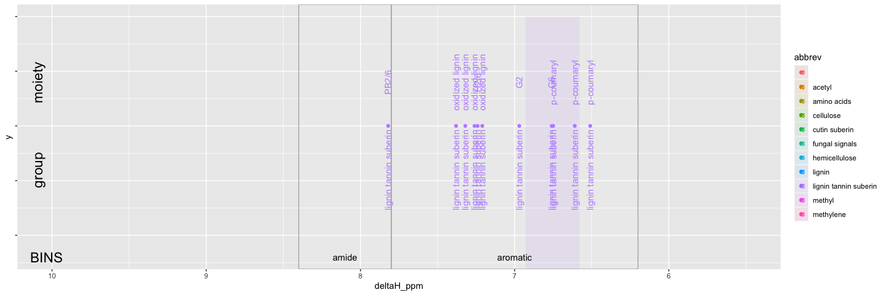
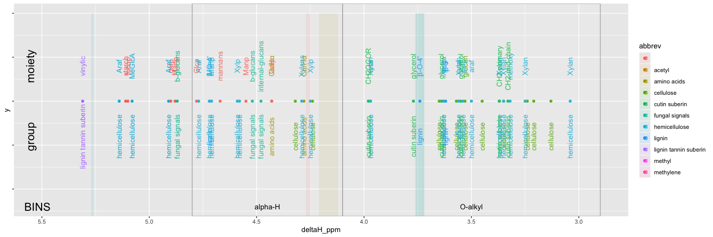
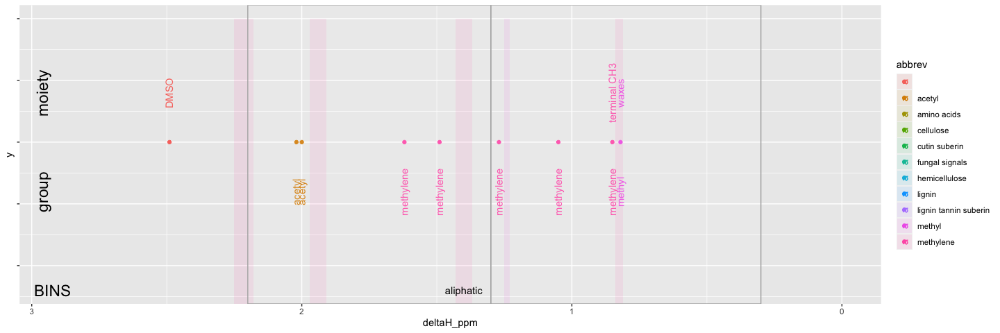

3-peak assignments
================
Kaizad Patel
4/9/2020

Assigning groups/moieties to peaks (1H NMR in DMSO)

  - peaks assigned following [Soucemarianadin et
    al. 2017](https://doi.org/10.1016/j.orggeochem.2017.06.019)
    
      - reported as point values and as ranges

  - binning assigned following [Clemente et
    al. 2012](https://doi.org/10.1071/EN11096)

<!-- --><!-- --><!-- -->
