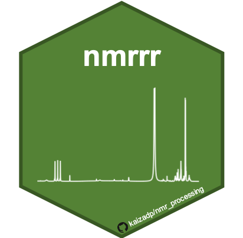
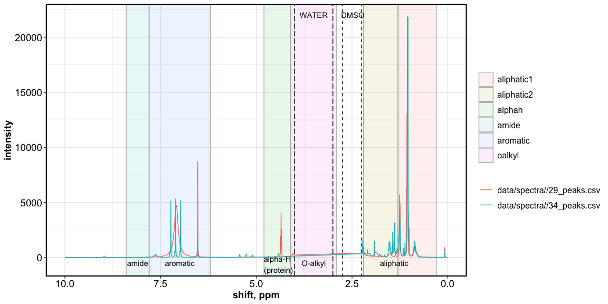
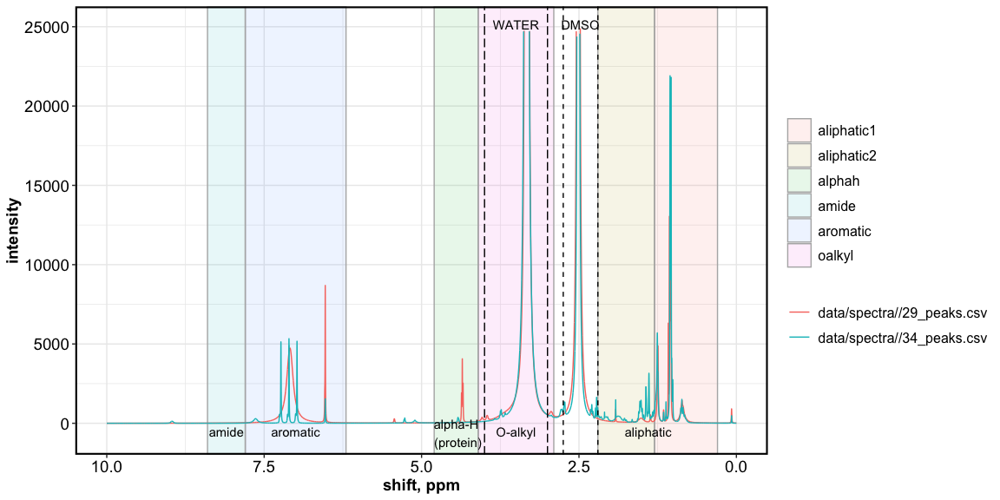

# nmrrr

This script is designed for batch processing and analysis of **NMR
r**esults in **R** (nmrrr).

Use this script for:  
(a) plotting spectra  
(b) calculating relative abundance of functional groups  
(c) peak assignments

Before using this script, NMR spectra must be processed in MestreNova
(phase corrected, baseline corrected, deconvoluted, peak picked,
normalized).

-----

Example spectra:  
spectra processed in MestreNova, with automated Global Spectral
Deconvolution.  
Water and solvent (DMSO) regions removed for graphing purposes. Still
needs some cleaning.

<!-- -->

Including solvents

<!-- -->
