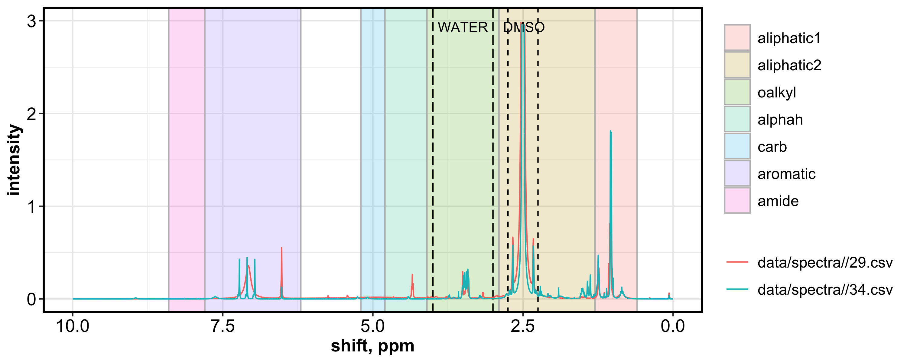
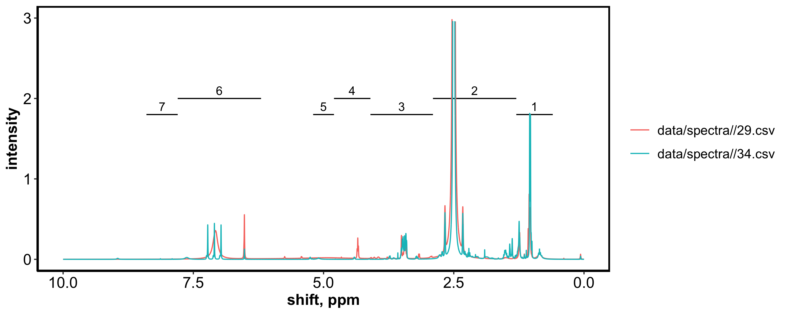

# nmrrr

This script is designed for batch processing and analysis of **NMR
r**esults in **R** (nmrrr).

Use this script for:  
(a) plotting spectra  
(b) calculating relative abundance of functional groups  
(c) peak assignments

Before using this script, NMR spectra must be processed in MestreNova
(phase corrected, baseline corrected, deconvoluted, peak picked,
normalized).

------------------------------------------------------------------------

2021-06-09 update: We are currently streamlining this workflow by
converting the script into reproducible functions. They can be found in
`code/nmrrr_workflow/`. -KFP

2021-07-10 update: The `vignettes` directory contains tutorials on how
to use this package. The .md files are the rendered Markdown reports,
and the .Rmd files are the source files for the reports. - KFP

------------------------------------------------------------------------

Example spectra:  
spectra processed in MestreNova, with automated Global Spectral
Deconvolution.  
Water peak removed during processing. Avoid using DMSO and water regions
for further analyses.

### spectra plot version 1: with banded regions for bins

This is good for visualization, not necessarily ideal for manuscripts.

### spectra plot version 2: with bracketed regions for bins

Preferred for manuscripts.

These bins were obtained from [Mitchell et al. 2018, *Soil
Systems*](https://doi.org/10.3390/soils2010008).  
(1) aliphatic polymethylene and methyl groups (0.6-1.3 ppm); (2) N- and
O-substituted aliphatic (1.3–2.9 ppm); (3) O-alkyl (2.9–4.1 ppm); (4)
α-proton of peptides (4.1–4.8 ppm); (5) anomeric proton of carbohydrates
(4.8–5.2 ppm); (6) aromatic and phenolic (6.2–7.8 ppm); and (7) amide
(7.8–8.4 ppm). The peak at 2.50 ppm arises from the solvent (DMSO-d6).

------------------------------------------------------------------------

## BINS USED

These are the options available in the file `0-NMR_BINS.csv`

| binset name  | state    | solvent | reference                                                                           |
|--------------|----------|---------|-------------------------------------------------------------------------------------|
| Clemente2012 | solution | DMSO-d6 | [Clemente et al. *Environmental Chemistry*](https://doi.org/10.1071/EN11096)        |
| Mitchell2018 | solution | DMSO-d6 | [Mitchell et al. 2018, *Soil Systems*](https://doi.org/10.3390/soils2010008)        |
| Lynch2019    | solution | D2O     | [Lynch et al. *Global Biogeochemical Cycles*](https://doi.org/10.1029/2018GB006030) |
