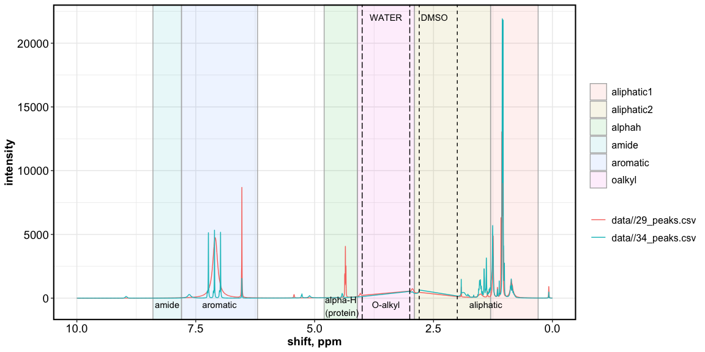

NMR processing
================
Kaizad Patel
2020-01-31

Last updated: 2020-02-01

This script is to batch-analyze processed NMR spectra (phase corrected,
baseline corrected, deconvoluted, peak picked).

Select the appropriate binning option and then plot and calculate
relative abundances.

-----

Example spectra:  
spectra processed in MestreNova, with automated Global Spectral
Deconvolution.  
Water and solvent (DMSO) regions removed for graphing purposes. Still
needs some cleaning.

<!-- -->

Including solvents

<!-- -->
