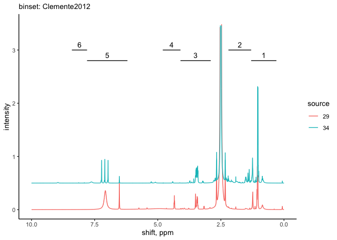
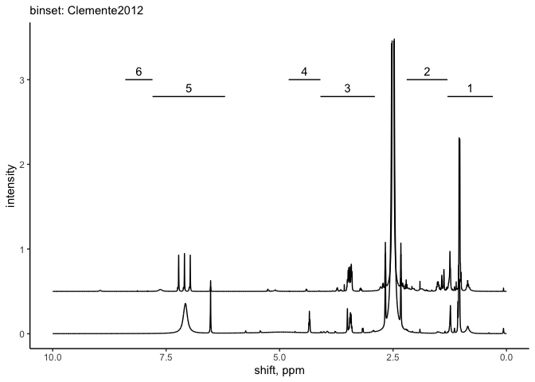

nmrrr - general workflow
================

This vignette represents the general workflow for processing NMR data
using the *nmrrr* package.

This package works only on processed data (e.g., phase-corrected,
baseline-corrected, peak-picked, etc.). For tips on processing NMR data
in MestreNova, check out the [repository
wiki](https://github.com/kaizadp/nmrrr/wiki).

------------------------------------------------------------------------

<details>
<summary>
A note on the dataset - click to open
</summary>

The data used in this example are a subset of the dataset generated for
Patel et al. “Soil carbon dynamics during drying vs. rewetting:
Importance of antecedent moisture conditions”. [DOI:
10.1016/j.soilbio.2021.108165](https://doi.org/10.1016/j.soilbio.2021.108165).

Soils were subjected to two treatments:

1.  drought: soils were dried and then rewet to 50 % moisture (w/w)
2.  flood: soils were saturated and then dried to 50 % moisture (w/w)

</details>

------------------------------------------------------------------------

Notes:

-   If you have individual files for your multi-sample batch, save all
    spectra files in one folder and peaks files in another folder
-   All input files must be in .csv format

------------------------------------------------------------------------

## PART I: Setup (parameters)

``` r
library(tidyverse)
library(readxl)
```

### Step 1. `source` the functions

(*once we have the package, we won’t have to `source`, just load the
package - KP* )

``` r
source("code/nmrrr_workflow/1-functions_processing.R")
source("code/nmrrr_workflow/3-functions_graphs.R")
```

### Step 2. set the bins using BINSET = …

``` r
BINSET = "Clemente2012"
bins_dat = set_bins(BINSET)
```

### Step 3. Set input directories

``` r
SPECTRA_FILES = "data/KFP_hysteresis/spectra/"
PEAKS_FILES = "data/KFP_hysteresis/peaks/"
```

------------------------------------------------------------------------

## PART II: Processing spectra files

``` r
spectra_processed = import_nmr_spectra_data(SPECTRA_FILES)
```

This function will:

-   import all the files from the SPECTRA\_FILES location,
-   combine them into a single dataframe,
-   clean the dataframe,
-   and generate a dataframe with columns for ppm-shift, intensity, and
    sample-ID

``` r
head(spectra_processed)
```

    ##           ppm  intensity source
    ## 1 0.000250458 0.00194982     29
    ## 2 0.000556024 0.00195503     29
    ## 3 0.000861589 0.00196025     29
    ## 4 0.001167150 0.00196509     29
    ## 5 0.001472720 0.00197068     29
    ## 6 0.001778290 0.00197589     29

------------------------------------------------------------------------

## PART III: Plotting the spectra

The `gg_spectra()` function will plot all the spectra present in the
`spectra_processed` file.

``` r
gg_spectra(dat = spectra_processed, 
           LABEL_POSITION = 3, 
           aes(x = ppm, y = intensity, group = source, color = source),
           STAGGER = 0.5) + 
  labs(subtitle = paste("binset:", BINSET))+
  ylim(0, 3.5)
```

<!-- -->

The compound classes (bins) are labelled in the graph. Adjust the
position (y-axis) using `LABEL_POSITION = ...`.

Overlaid spectra can be staggered along the y-axis using
`STAGGER - ...`.

This function makes use of `ggplot2` capabilities, and the plot can
therefore be customized using `ggplot2` nomenclature.

<details>
<summary>
Additional examples using `gg_spectra()` - *click to open*
</summary>

``` r
gg_spectra(dat = spectra_processed, 
           LABEL_POSITION = 3, 
           aes(x = ppm, y = intensity, group = source),
           STAGGER = 0.5) + 
  labs(subtitle = paste("binset:", BINSET))+
  ylim(0, 3.5)
```

<!-- -->

</details>

------------------------------------------------------------------------

## PART IV: Processing peaks data

When exporting peaks data from MestreNova, the data are generally split
across multiple columns.

The `import_nmr_peaks()` function will import the files in that format
and then collapse all the columns for a single long-form dataframe.

``` r
peaks_processed = import_nmr_peaks(PEAKS_FILES)
```

``` r
head(peaks_processed)
```

    ##     ppm Intensity Width  Area     Type Flags Impurity/Compound Annotation
    ## 31 1.24       0.3  8.13 29.14 Compound  None                NA         NA
    ## 32 1.23       0.2  2.27  5.42 Compound  None                NA         NA
    ## 33 1.11       0.2  0.89  2.21 Compound  None                NA         NA
    ## 34 1.07       0.2  0.80  1.55 Compound  None                NA         NA
    ## 35 1.05       0.3  0.74  2.76 Compound  None                NA         NA
    ## 36 1.04       1.4  2.81 44.60 Compound  None                NA         NA
    ##    source      group
    ## 31     27 aliphatic1
    ## 32     27 aliphatic1
    ## 33     27 aliphatic1
    ## 34     27 aliphatic1
    ## 35     27 aliphatic1
    ## 36     27 aliphatic1

**Note: The user may want to assign additional filtering steps to filter
certain flagged data points, e.g. impurities, weak peaks, etc. **

For this current dataset, because of the strong influence of water peaks
in the o-alkyl region, we exclude that region from our calculations.

``` r
peaks_processed2 = 
  peaks_processed %>% 
  filter(group != "oalkyl")
```

------------------------------------------------------------------------

## PART V: Exporting the processed data

The processed dataframes generated here can be exported using the usual
R export functions, e.g. `write.csv()`, `write.table()`, etc.

------------------------------------------------------------------------

<details>
<summary>
Session Info - click to open
</summary>

Date run: 2021-07-10

    ## R version 4.0.2 (2020-06-22)
    ## Platform: x86_64-apple-darwin17.0 (64-bit)
    ## Running under: macOS Catalina 10.15.7
    ## 
    ## Matrix products: default
    ## BLAS:   /Library/Frameworks/R.framework/Versions/4.0/Resources/lib/libRblas.dylib
    ## LAPACK: /Library/Frameworks/R.framework/Versions/4.0/Resources/lib/libRlapack.dylib
    ## 
    ## locale:
    ## [1] en_US.UTF-8/en_US.UTF-8/en_US.UTF-8/C/en_US.UTF-8/en_US.UTF-8
    ## 
    ## attached base packages:
    ## [1] stats     graphics  grDevices utils     datasets  methods   base     
    ## 
    ## other attached packages:
    ##  [1] readxl_1.3.1    forcats_0.5.1   stringr_1.4.0   dplyr_1.0.6    
    ##  [5] purrr_0.3.4     readr_1.4.0     tidyr_1.1.3     tibble_3.1.2   
    ##  [9] ggplot2_3.3.3   tidyverse_1.3.1
    ## 
    ## loaded via a namespace (and not attached):
    ##  [1] tidyselect_1.1.0  xfun_0.20         haven_2.3.1       colorspace_2.0-0 
    ##  [5] vctrs_0.3.8       generics_0.1.0    htmltools_0.5.1.1 yaml_2.2.1       
    ##  [9] utf8_1.1.4        rlang_0.4.10      pillar_1.6.1      glue_1.4.2       
    ## [13] withr_2.4.1       DBI_1.1.1         dbplyr_2.1.1      modelr_0.1.8     
    ## [17] lifecycle_1.0.0   munsell_0.5.0     gtable_0.3.0      cellranger_1.1.0 
    ## [21] rvest_1.0.0       evaluate_0.14     labeling_0.4.2    knitr_1.31       
    ## [25] fansi_0.4.2       highr_0.8         broom_0.7.6       Rcpp_1.0.6       
    ## [29] scales_1.1.1      backports_1.2.1   jsonlite_1.7.2    farver_2.0.3     
    ## [33] fs_1.5.0          hms_1.0.0         digest_0.6.27     stringi_1.5.3    
    ## [37] grid_4.0.2        cli_2.5.0         tools_4.0.2       magrittr_2.0.1   
    ## [41] crayon_1.4.1      pkgconfig_2.0.3   ellipsis_0.3.2    xml2_1.3.2       
    ## [45] reprex_2.0.0      lubridate_1.7.10  assertthat_0.2.1  rmarkdown_2.6.6  
    ## [49] httr_1.4.2        rstudioapi_0.13   R6_2.5.0          compiler_4.0.2

</details>

------------------------------------------------------------------------
