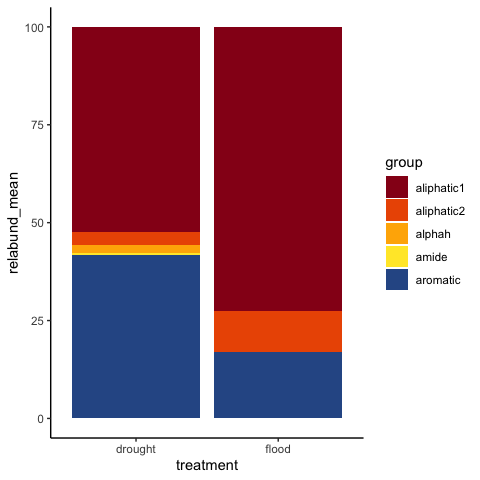

nmrrr - relative abundance
================

This vignette demonstrates the general workflow for computing and
reporting/graphing relative abundance data.

The *nmrrr* package includes the capability to compute the relative
abundance, but not the graphs. We provide an example script here for
plotting relative abundance using stacked bar plots.

------------------------------------------------------------------------

This vignette uses the `peaks_processed2` output generated by vignette
\#1.

Relative abundances are calculated based on the integration of peaks in
each region.

------------------------------------------------------------------------

## PART 1: Setup

``` r
source("code/nmrrr_workflow/2-functions_relabund.R")
```

Set/import the corekey

``` r
COREKEY = "data/KFP_hysteresis/corekey.csv"
corekey = read.csv(COREKEY) %>% mutate(Core = as.character(Core))
```

Set the treatments (grouping variables) for the rel-abund calculations.

``` r
TREATMENTS = quos(treatment)
```

We are currently using the `treatment` column as a grouping variable for
the relative abundance

Users can replace this with the column names they want. Users can use
multiple column names, just separate them with a comma:
`quos(treatment1, treatment2)`

------------------------------------------------------------------------

## PART II: Calculate relative abundances

### Step 1: Relative abundance for each sample

If there are multiple replicates for each treatment, we must first
calculate relative abundance for each replicate.

These data will also be used for running multivariate statistics,
e.g. PCA, PERMANOVA, etc. (see the corresponding “Statistics” vignette
for more details.)

``` r
relabund_cores = compute_relabund_cores(peaks_processed2, bins_dat, corekey)
```

``` r
head(relabund_cores)
```

    ## # A tibble: 6 x 4
    ## # Groups:   Core [2]
    ##   Core  treatment group      relabund
    ##   <chr> <chr>     <chr>         <dbl>
    ## 1 27    drought   aliphatic1    68.4 
    ## 2 27    drought   aliphatic2     4.61
    ## 3 27    drought   alphah         0.45
    ## 4 27    drought   aromatic      26.6 
    ## 5 27    drought   amide          0   
    ## 6 28    drought   aliphatic1    70.4

### Step 2: Relative abundance summary (for each treatment)

Use this function to compute summary statistics of relative abundance
for each treatment.

Mean, SD, SE are calculated.

This relabund\_summary can be used for bar graphs and summary tables,
see below.

``` r
relabund_summary = compute_relabund_summary(relabund_cores, TREATMENTS)
```

``` r
head(relabund_summary)
```

    ## # A tibble: 6 x 4
    ## # Groups:   group [3]
    ##   group      treatment relabund_mean relabund_se
    ##   <chr>      <chr>             <dbl>       <dbl>
    ## 1 aliphatic1 drought           52.3        10.1 
    ## 2 aliphatic1 flood             72.7         3.47
    ## 3 aliphatic2 drought            3.31        1.27
    ## 4 aliphatic2 flood             10.5         1.96
    ## 5 alphah     drought            2.11        1   
    ## 6 alphah     flood              0           0

------------------------------------------------------------------------

## PART III: Summary table

Use `relabund_summary`.

### Step 1: Simple table, no statistics

``` r
relabund_summarytable = 
  relabund_summary %>% 
  mutate(relabund = paste(relabund_mean, "\u00b1", relabund_se),
         relabund = str_remove_all(relabund, " \u00b1 NA")) %>% 
  dplyr::select(group, treatment, relabund) %>% 
  pivot_wider(names_from = "treatment", values_from = "relabund") %>% 
  mutate(group = factor(group,
                        levels = c("aliphatic1", "aliphatic2", "alphah", "aromatic", "amide"))) %>% 
  arrange(group)

relabund_summarytable %>% knitr::kable()
```

| group      | drought       | flood        |
|:-----------|:--------------|:-------------|
| aliphatic1 | 52.31 ± 10.09 | 72.66 ± 3.47 |
| aliphatic2 | 3.31 ± 1.27   | 10.48 ± 1.96 |
| alphah     | 2.11 ± 1      | 0 ± 0        |
| aromatic   | 41.81 ± 10.41 | 16.86 ± 3.38 |
| amide      | 0.46 ± 0.27   | 0 ± 0        |

### Step 2: Table with statistics

*coming soon*

------------------------------------------------------------------------

## PART IV: Bar graphs

Use `relabund_summary`.

``` r
(relabund_bar = 
   relabund_summary %>% 
   ggplot(aes(x = treatment, y = relabund_mean, fill = group))+
   geom_bar(stat = "identity")+
   scale_fill_manual(values = rev(soilpalettes::soil_palette("redox2", 5)))+
   theme_classic()+
   NULL)
```

<!-- -->

------------------------------------------------------------------------

<details>
<summary>
Session Info - click to open
</summary>

Date run: 2021-07-10

    ## R version 4.0.2 (2020-06-22)
    ## Platform: x86_64-apple-darwin17.0 (64-bit)
    ## Running under: macOS Catalina 10.15.7
    ## 
    ## Matrix products: default
    ## BLAS:   /Library/Frameworks/R.framework/Versions/4.0/Resources/lib/libRblas.dylib
    ## LAPACK: /Library/Frameworks/R.framework/Versions/4.0/Resources/lib/libRlapack.dylib
    ## 
    ## locale:
    ## [1] en_US.UTF-8/en_US.UTF-8/en_US.UTF-8/C/en_US.UTF-8/en_US.UTF-8
    ## 
    ## attached base packages:
    ## [1] stats     graphics  grDevices utils     datasets  methods   base     
    ## 
    ## other attached packages:
    ##  [1] readxl_1.3.1    forcats_0.5.1   stringr_1.4.0   dplyr_1.0.6    
    ##  [5] purrr_0.3.4     readr_1.4.0     tidyr_1.1.3     tibble_3.1.2   
    ##  [9] ggplot2_3.3.3   tidyverse_1.3.1
    ## 
    ## loaded via a namespace (and not attached):
    ##  [1] tidyselect_1.1.0   xfun_0.20          haven_2.3.1        colorspace_2.0-0  
    ##  [5] vctrs_0.3.8        generics_0.1.0     htmltools_0.5.1.1  yaml_2.2.1        
    ##  [9] utf8_1.1.4         rlang_0.4.10       pillar_1.6.1       glue_1.4.2        
    ## [13] withr_2.4.1        DBI_1.1.1          dbplyr_2.1.1       modelr_0.1.8      
    ## [17] lifecycle_1.0.0    munsell_0.5.0      gtable_0.3.0       cellranger_1.1.0  
    ## [21] rvest_1.0.0        evaluate_0.14      labeling_0.4.2     knitr_1.31        
    ## [25] fansi_0.4.2        highr_0.8          broom_0.7.6        Rcpp_1.0.6        
    ## [29] scales_1.1.1       backports_1.2.1    jsonlite_1.7.2     farver_2.0.3      
    ## [33] fs_1.5.0           hms_1.0.0          digest_0.6.27      stringi_1.5.3     
    ## [37] grid_4.0.2         cli_2.5.0          tools_4.0.2        magrittr_2.0.1    
    ## [41] crayon_1.4.1       pkgconfig_2.0.3    ellipsis_0.3.2     xml2_1.3.2        
    ## [45] reprex_2.0.0       lubridate_1.7.10   assertthat_0.2.1   rmarkdown_2.6.6   
    ## [49] httr_1.4.2         rstudioapi_0.13    soilpalettes_0.1.0 R6_2.5.0          
    ## [53] compiler_4.0.2

</details>

------------------------------------------------------------------------
